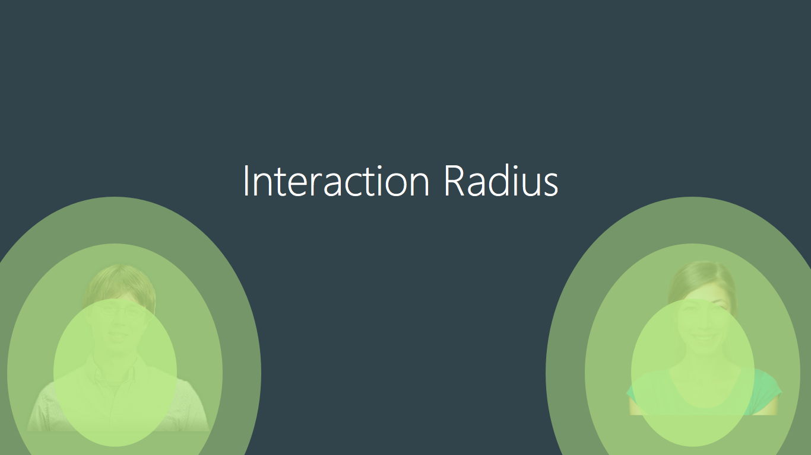
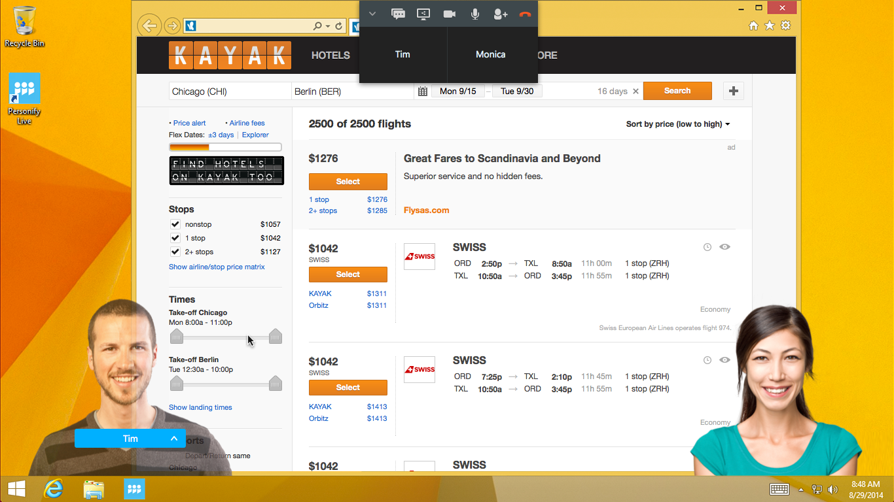
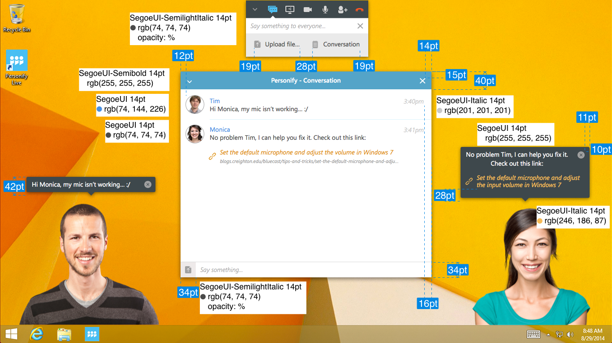

### Personify Collaboration v 1.0.0

# Design Guidelines

By [nando rossi](mailto:talk@nan.do)

### Introduction

This guide is intended as a way to assist implementation of the Personify Application designs. The document is being initially created with the Windows version in mind; as we roll out other platforms, the details specific to them will be included, although we will keep a goal in mind: a **unified vision**.

### The Vision

The goal of this app is to promote collaboration and bring people closer together using technology in a seamless way.

- All Personify apps should **Feel** like Personify. They must "speak" to one another visually, regardless of platform
- Interface should always be as minimal as possible. The **work** and the **people** should be at the front and center.
- Take advantage of the platform. Before implementing Personify to a new platform, consider that platform's strengths and weaknesses, and look at each feature individually:
	- What types of input work best in this platform?
	- Can this feature be "translated" in a way that is logically similar to the other platforms, and yet follows this platform's best practices?
	- Does this feature **make sense** in this platform? Is it essential?
- Build from the ground up. Get the simple things **right** first, then complicate it. It's much easier to see what works and what doesn't when you start small than when you have to trim it down.

### Global Styles

## Fonts & Palette

### Segoe UI

The main font used for Personify is **Segoe UI**, which is also the font most commonly associated with the Windows "Modern" interface. It's clear, it's international and although it's a Windows font, it can exist well outside of it.

It is also a modern sans-serif font, but not the over-used (and at the moment very associated with Apple) Helvetica.

These weights will be used throughout the app:

- Light
- Semilight
- Normal
- Semibold

Font sizes try to follow the **Modular Scale** whenever possible (there are some exceptions):
9, 10, 11, 12, 13, 14, 18, 20, 24, 36, 48, 64, 72, 144, 288

### Colors

The entire palette for the app stems from these main colors:

- White: `#FFFFFF`
- Light Blue: `#00B0FF`
- Dark Blue: `#3E484C`
- Red: `#D05F5`

## Iconography

- Friendly but adult
- Single-color icons (some icons can also feature a 40% opacity version of the color)
- Universally recognizable icons should be used whenever possible (such as **share** and **x** for closing)
- The **phone** metaphor is used when referencing 

## Window design
- As minimal as possible, to let users see work/shared windows/each other as much as possible
- Self-contained; focus the action on the Toolbar window
- Use modals whenever possible instead of "sticky" windows
- Allow user to make windows "stick"

### App sections

## Onboarding
(add this)

## Home & Login

### Login screen

#### Login

##### Login - Error

### Home Screen

#### Home Screen

### Starting a call

#### Start a call

#### Recent calls

#### New Call - Recent callers

#### New Call - Autosuggest

#### New Call - Copy Link

#### Receiving a call

## In-call

### The Toolbar

#### Single user

### The Thumbnail Bar

(add this)

### Add user in-call

Step 1 - modal overlay on thumbnail screen  
Step 2 - as user types, see [autosuggest](#autosuggest).

## Manipulating Personas

### The "Interaction Radius"

(describe & explain this)

### Moving personas left-right

As a user, I want to move my *persona* around to allow me to see my work/other windows.

As I move my cursor towards the *persona*, it fades out, but a blue box is still visible. I can click on that box and drag the persona side-to-side, and it's anchored to the bottom of the screen.

(design this)

If I move the box **upwards**, the box displays an "up arrow" and if I let go, the persona moves up to the "thumbnail box" (with a nice transition animation).

## Chat

#### Chat Window & Speech bubbles

As a user, I want to send messages and files to my chat partners without disrupting my workflow.

I can click on the "messages" icon.
A **modal** is displayed, with:

- Text field
- "Upload file" button
- "Conversation" button

I can type a message on the text field, and it gets sent to all users as a "chat bubble", which gets displayed and goes away. Uploaded files have the same effect.

I can click the "conversation" button and it fires up a standard "chat" window, which should then disable the "chat bubbles" (only for as long as it's focused).

## Screen Sharing

As a user, I want to share an application I'm using with my chat partners.

I can click the **screen share button**

Which displays a "select window" dialog. I can then select which window to share.

The window I'm currently sharing will take on a thick outline to make it clear.

## Screen Recording

As a user, I want to create and share videos of my screen while I perform a variety of activities.

- At the home screen, I roll over the "Screen Recording" button
- I then select "new recording"

Recording - Styles

I choose my settings and then click "start recording."

There is a countdown, I record. 

When I'm done, I press the "stop" button and the video gets uploaded.

While the file uploads, I can share the video, or copy the link to it.

